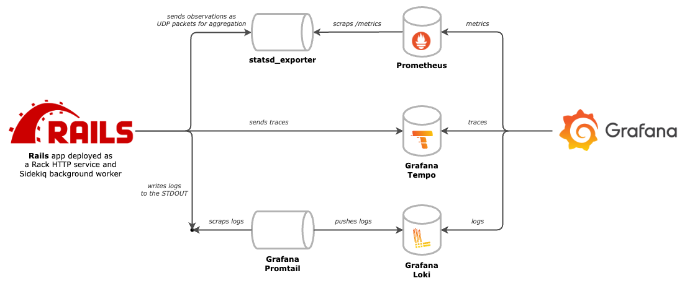

# OpenTelemetry ∩ Rails

A reference repository for instrumenting Rails apps. It presents what can be achieved using generally available self-hosted software, as opposed to leveraging observability to cloud providers. It's suited for testing and debugging, not as a guidance for production setups.

It's _opinionated_ in a way that the included libraries and solutions do have alternatives. The main intention though is to stick with Open Source and Open Standards. I'm willing to see suggestions and discussions about different approaches.

The repository is being gradually updated as Open Telemetry SDK and Open Telemetry Contrib Packages for Ruby progress.

I recommend visiting [open-telemetry/opentelemetry-demo](https://github.com/open-telemetry/opentelemetry-demo) for a complete example of instrumentation of a distributed system.

# Included tech stack

What's being observed:

- [Ruby on Rails](https://github.com/rails/rails) app (HTTP service)
- [Sidekiq](https://github.com/sidekiq/sidekiq) app (background processing)

Services used for gathering and accessing telemetry data:

- [Promtail](https://grafana.com/docs/loki/latest/send-data/promtail/) and [Loki](https://grafana.com/docs/loki/latest/) for logs
- [Tempo](https://github.com/grafana/tempo) for tracing
- [statsd_exporter](https://github.com/prometheus/statsd_exporter) and [Prometheus](https://github.com/prometheus/prometheus) for metrics
- [Grafana](https://github.com/grafana/grafana) for visualization

# Short demo

# Logs

The [rails_semantic_logger](https://github.com/reidmorrison/rails_semantic_logger) gem is used in the Rails app to produce and output logs to the `STDOUT`. Then, **promtail** scraps logs from the docker's standard output and pushes them to **Loki**. **Loki** stores the logs and makes them available for querying in **Grafana**.

Logs are outputted in the `fmt` format. In addition to standard fields, there are extra fields included: `request_id`, `trace_id`, `span_id` and `operation`.

# Traces

The Rails app is auto-instrumented with suitable Open Telemetry Contrib packages. The list of all available packages can be found on the [OpenTelemetry registry](https://opentelemetry.io/ecosystem/registry/?s=&component=&language=ruby).

Traces produced by the instrumentation are being exported to **Tempo**. **Tempo** stores the traces and makes them available for querying in **Grafana**.

# Metrics

Metrics are emitted in the **StatsD** style. Currently, the only instrumentation is the [statsd-rack-instrument](https://rubygems.org/gems/statsd-rack-instrument) measuring HTTP requests.

Metrics are sent to the `statsd_exporter` which then aggregates and exposes metrics in the **Prometheus** format. **Prometheus** scraps the `statsd_exporter`, stores and makes metrics available for querying in **Grafana**.
\
See a lengthy explanation why this approach is suggested https://mkaz.me/blog/2023/collecting-metrics-from-multi-process-web-servers-the-ruby-case/

# Correlating logs, traces, and metrics

# Tests instrumentation

# TODO

- Siekiq metrics

- Exemplars to enable metrics <-> traces navigation

- dashboards - rack and sidekiq
