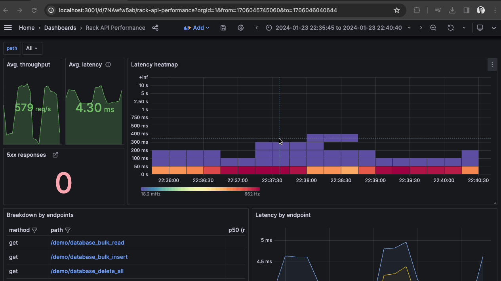
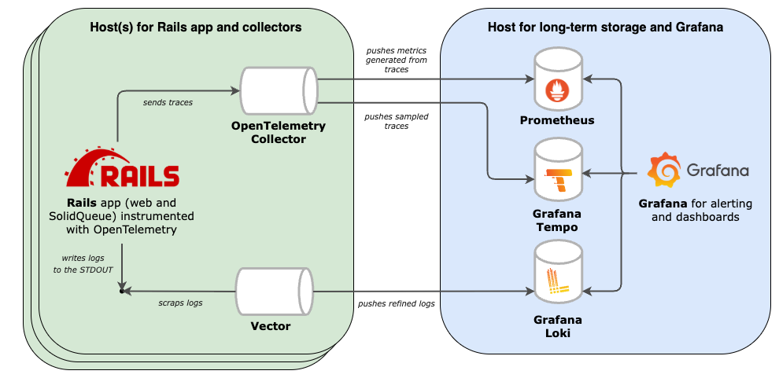

# Observability for Rails with OpenTelemetry <!-- omit in toc -->

A reference repository for instrumenting Rails apps with observability, using self-hosted, open-source tools rather than commercial observability platforms. It’s intended primarily for testing, experimentation, and debugging - not as an ultimate guidance for production setups.

It's _opinionated_ in the way that included libraries and solutions do have alternatives. The goal is to stay aligned with Open Source and Open Standards.  Suggestions and discussions around alternative approaches are welcome.

The stack is available in two forms:
- as a **Kamal** deployment - see `rails_app/config/deploy/yml`
- as a **Docker Compose** - see `docker-compose.yml`

The repository is being gradually updated as Open Telemetry SDK and Open Telemetry Contrib Packages for Ruby progress. (Note: as of now, the Ruby OTel instrumentation for metrics and traces is WIP.)

I recommend visiting [open-telemetry/opentelemetry-demo](https://github.com/open-telemetry/opentelemetry-demo) for a complete example of instrumentation of a distributed system.

## Table of Contents <!-- omit in toc -->

- [Short demo](#short-demo)
- [Included tech stack](#included-tech-stack)
  - [Telemetry Data Producers](#telemetry-data-producers)
  - [Collection and processing agents](#collection-and-processing-agents)
  - [Storage and query backends](#storage-and-query-backends)
  - [Visualization](#visualization)
- [Deployment](#deployment)
  - [Kamal](#kamal)
  - [Docker Compose](#docker-compose)
- [Telemetry data](#telemetry-data)
  - [Logs](#logs)
  - [Traces](#traces)
  - [Metrics](#metrics)
  - [Correlating logs, traces and metrics](#correlating-logs-traces-and-metrics)
- [TODOs](#todos)


## Short demo



## Included tech stack

### Telemetry Data Producers

Currently, the source of the telemetry data is a [Ruby on Rails](https://github.com/rails/rails) app, which acts as a web server and a [SolidQueue](https://github.com/rails/solid_queue) background jobs processor. It's instrumented with [OpenTelemetry](https://opentelemetry.io/docs/languages/ruby/) to emit traces to the collector and outputs logs to the STDOUT.

### Collection and processing agents

Agent(s) run on the same host as the Rails application. Their role is to collect, process, and export telemetry data. Up to this point, the architecture is vendor-agnostic, allowing to switch destinations or test multiple destinations without changes to the application code.

Included agents:

- [OpenTelemetry Collector](https://github.com/open-telemetry/opentelemetry-collector)
  - receives, processes, and exports traces
  - derives metrics from traces and exports them to Prometheus
- [Vector](https://vector.dev/)
  - scraps, processes, and exports logs

### Storage and query backends

Since this demo presents a self-hosted approach, this part represents the long-term storage and query API backends. It's strongly recommended to run these services on a separate host to increase the likelihood of accessing observability data during application outages.

Included services:

- [Tempo](https://github.com/grafana/tempo) for traces
- [Loki](https://github.com/grafana/loki) for logs
- [Prometheus](https://github.com/prometheus/prometheus) for metrics

### Visualization

- [Grafana](https://github.com/grafana/grafana) dashboarding for traces, logs, and metrics


## Deployment


### Kamal



The Rails app includes a proposed Kamal deployment for the entire observability stack. The setup defines three servers:
- App Server - runs the Rails application and telemetry agents
- DB Server – hosts the database
- Observability Server – runs Grafana and stores telemetry data (traces, logs, metrics)

You can find the full configuration in `rails_app/config/deploy.yml`

Note: This deployment setup is provided as a general example. While it has been successfully tested in a live environment, it's not intedned to be used on-spot. You may need to adapt it to suit your specific requirements.

### Docker Compose

Docker Compose allows to run the entire stack locally and experiment with it.

Most of the commands to operate this repo are available through the Makefile.

1. Start the stack by running:

```sh
make up
```

2. Make a sample request:

```sh
curl localhost:3000/demo/database_bulk_read
```

or you can run the included load tests with k6. For more details, check the k6 subdirectory: [K6 load test](https://github.com/michal-kazmierczak/opentelemetry-rails-example/tree/main/k6)

3. Visit the Grafana `Rack API Performance` dashboard to see graphs http://localhost:3001/d/7NAwfw5ab/rack-api-performance

## Telemetry data

### Logs

The [rails_semantic_logger](https://github.com/reidmorrison/rails_semantic_logger) gem is used in the Rails app to produce and output logs to the `STDOUT` in the JSON format. Then, **Vector** scraps logs from the docker's standard output, removes redundant fields, and pushes them to **Loki** in a more human-friendly `fmt` format. **Loki** stores the logs and makes them available for querying in **Grafana**.

In addition to standard fields, there are extra fields included: `request_id`, `trace_id`, `span_id` and `operation`.

### Traces

The Rails app is auto-instrumented with suitable Open Telemetry Contrib packages. The list of all available packages can be found on the [OpenTelemetry registry](https://opentelemetry.io/ecosystem/registry/?s=&component=&language=ruby).

Traces produced by the instrumentation are being sent to the **OpenTelemetry Collector**. Then, **OpenTelemetry Collector** applies tail sampling to drop noisy traces (with the latency <10ms), and exports them to **Tempo** which stores the traces and makes them available for querying in **Grafana**.

### Metrics

The Rails application does not emit metrics directly. Instead, metrics are derived from spans (all, not samples) using the spanmetrics processor in the OpenTelemetry Collector.

### Correlating logs, traces and metrics

The real synergy comes from correlating all the pillars of observability - logs, traces, and metrics - together. It's super convenient to easily navigate from a log to a related trace or even from a spike in metric to a related trace. That's the main motivation behind including Grafana in the stack - a single UI that is capable of presenting and correlating all the data.

<!-- ## From logs to traces

## From logs to metrics

## From traces to logs

## From traces to metrics

## From metrics to logs

## From metrics to traces


# Tests instrumentation -->


## TODOs

- Own metrics with StatsD
